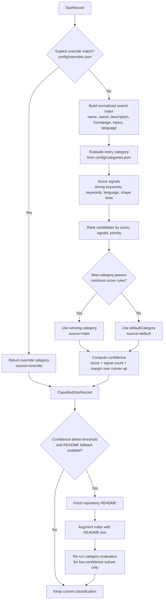

# Danilarious Star Atlas

A generated catalog of starred GitHub repositories, grouped into stable categories.

Last updated: `2026-03-28T06:11:31.371Z`

## About This Project

This repository generates a curated, searchable catalog from a GitHub account's starred repositories. It combines a data
pipeline, deterministic categorization rules, chunked JSON exports, and a static frontend so the result can be published
on GitHub Pages without a server runtime.

The project is useful if you want to:

- publish your starred repositories as a clean public directory,
- keep repository metadata and categories in version control,
- customize how projects are grouped with your own rules and overrides,
- reuse the structure for your own profile by forking or cloning the repository.

## Overview

- Total starred repositories: **29**
- Categories in use: **11**
- Newly detected this run: **0**
- Removed this run: **0**
- Metadata/category updates: **1**

## How It Works

The generator fetches starred repositories for `@Danilarious`, classifies each repository with stable rule-based
categories, writes the results into chunked files under `dist/data/`, and rebuilds this README together with the static
site
assets. The frontend then reads the generated catalog and chunk files to provide filtering, search, sorting, and
progressive loading in the browser. The main project-level settings now live in `config/config.json`, while
classification behavior stays in `config/categories.json` and `config/overrides.json`.

## Detailed Architecture Diagrams

The project is easiest to understand as six connected layers: orchestration, refresh decisions, classification,
artifact generation, browser runtime, and automation. The diagrams below map each layer to the actual source files.

### Deterministic Classification Engine



Classification is intentionally deterministic. The taxonomy lives in configuration, not hardcoded per repository.
Overrides win first, then rule-based scoring tries to find the strongest category. Only low-confidence items may trigger
extra README fetches, which keeps the fallback precise and avoids paying that cost for the full dataset.

## Use This Project

You can use this project in three common ways:

### 1. Fork It

Fork the repository if you want to keep the existing setup and adapt it for your own GitHub account. After forking,
edit `config/config.json` for your own username, README copy, and site SEO settings, then add a GitHub token before
running the generator on your fork.

### 2. Clone It

Clone the repository if you want full local control or if you plan to customize the data model, categorization rules,
UI, or deployment flow.

```bash
git clone <your-fork-or-copy-url>
    cd my-stars-atlas
    bun install
    ```

    The easiest setup flow is:

    ```bash
    bun run update
    ```

    Before your first run, update `config/config.json`:

    - `github.username`: the GitHub account whose stars will be indexed.
    - `readme.title` and `readme.description`: the generated README heading and intro text.
    - `site.title`, `site.heroDescription`, and `site.profileLinkLabel`: the visible site branding.
    - `site.seo.description`, `site.seo.ogDescription`, `site.seo.twitterDescription`: editable share text.
    - `site.manifest.shortName`, `site.manifest.description`: editable PWA labels.

    Additional config files:

    - `config/categories.json`: deterministic category definitions and priorities.
    - `config/overrides.json`: exclusions and manual category overrides.

    Optional environment variables:

    - `GITHUB_TOKEN` or `GH_TOKEN`: recommended to avoid low unauthenticated API limits.
    - `FORCE_REFRESH=true`: forces a full refetch even if the cached count has not changed.

    If you want to preview the generated site locally after a run, use `bun run preview` and open
    `http://localhost:4173`.

    ### 3. Contribute To It

    If you want to improve the project itself, contributions are welcome. Useful contribution areas include:

    - better category definitions and override rules,
    - UI and accessibility improvements for the static site,
    - GitHub API efficiency and sync logic,
    - documentation, automation, and deployment workflows.

    ## Contributing

    If you plan to contribute, use a normal fork-and-pull-request workflow:

    1. Fork the repository.
    2. Create a feature branch for your change.
    3. Run the generator or relevant checks locally.
    4. Open a pull request with a clear explanation of the change and its impact.

    Small fixes are fine, but detailed pull requests are especially helpful when they include rationale for taxonomy
    changes, UX adjustments, or sync behavior updates.

    ## Recent Stars

    - [neo4j-labs/ai-governor](https://github.com/neo4j-labs/ai-governor) - Quality gates for AI agents. Guards that don't get tired.
    - [viftode4/trustchain](https://github.com/viftode4/trustchain) - TrustChain - decentralized trust for AI agents. Rust core, QUIC P2P, transparent proxy, MCP server, dashboard
    - [saltbo/agent-kanban](https://github.com/saltbo/agent-kanban) - An agent-first task board, Mission control for your AI workforce.
    - [daltlc/zephyr-framework](https://github.com/daltlc/zephyr-framework) - Zero-JS interactive UI framework using Web Components, CSS :has(), View Transitions API, and container queries
    - [louislva/claude-peers-mcp](https://github.com/louislva/claude-peers-mcp) - Allow all your Claude Codes to message each other ad-hoc!
    - [AlbertBaubleDeem/joplin-plugin-google-docs](https://github.com/AlbertBaubleDeem/joplin-plugin-google-docs) - plugin to sync Joplin notes with Google Docs natively
    - [HorseSword/joplin-plugin-notellm](https://github.com/HorseSword/joplin-plugin-notellm) - NoteLLM is an AI plugin for Joplin. It's completely open-source and does not collect any logs or personal information.
    - [cqroot/joplin-outline](https://github.com/cqroot/joplin-outline) - A markdown outline (TOC) sidebar plugin for Joplin.
    - [hegerdes/joplin-plugin-remote-note-pull](https://github.com/hegerdes/joplin-plugin-remote-note-pull) - This Plugin can create a new Note from any Website and watches the site for changes.
    - [hieuthi/joplin-plugin-markdown-table-colorize](https://github.com/hieuthi/joplin-plugin-markdown-table-colorize) - Add colors to markdown table syntax to help distinguish different columns
    - [Sync-in/server](https://github.com/Sync-in/server) - Sync-in server · Secure, open-source platform for file storage, sharing, collaboration, and syncing.
    - [iflytek/skillhub](https://github.com/iflytek/skillhub) - Self-hosted, open-source agent skill registry for enterprises. Publish & version skill packages, govern with RBAC and audit logs, deploy   on-premise with Docker or Kubernetes.
